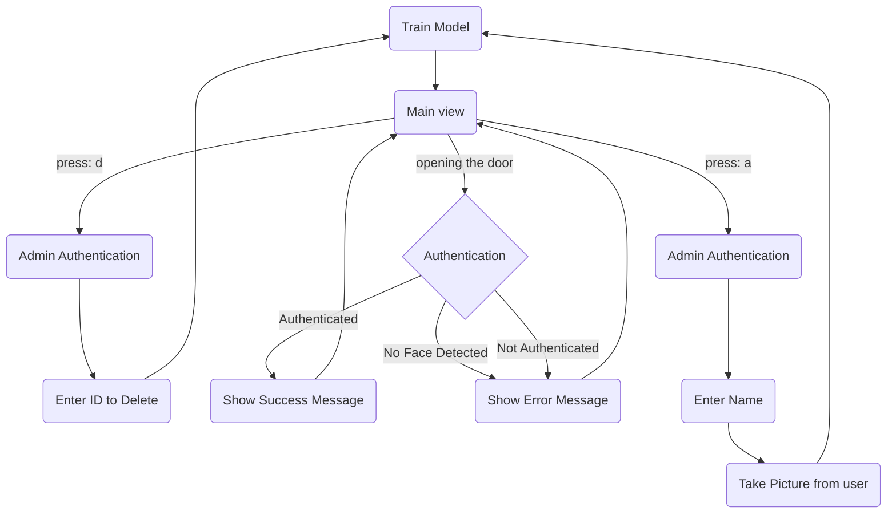

<div align="center">

# Face Detection and Recognition using Neural Network

</div>

---

## Install Requirements

Required libraries are listed in `requirements.txt` file. You can install all dependencies using this command

```shell
pip install -r requirements.txt
```

## Usage

| Input command | Description          |
|---------------|----------------------|
| `a`           | Add new user         |
| `d`           | Delete existing user |
| `q`, `Esc`    | Quit                 |

## Flow



## Admin Panel Dashboard

starting the server:

```shell
cd admin_panel && flask --app server run
```

## Running on Raspberry PI

[documentation](raspberry-pi-instruction.md)